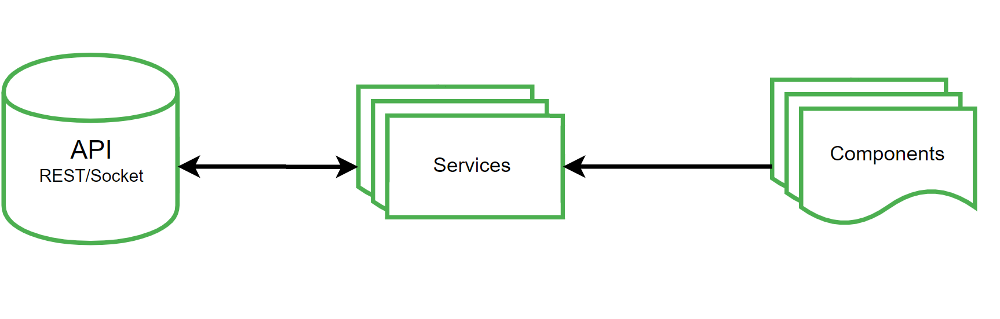
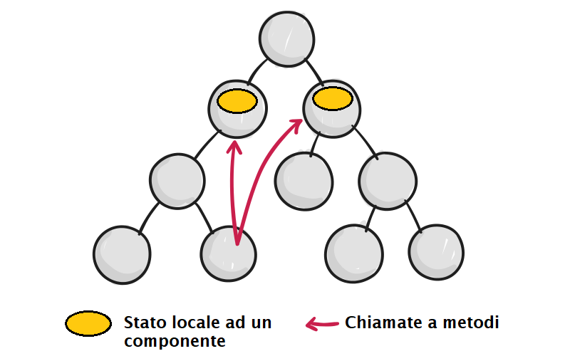
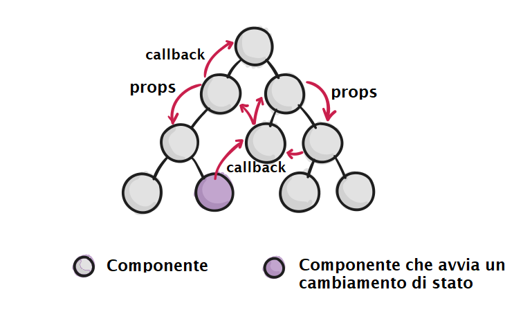
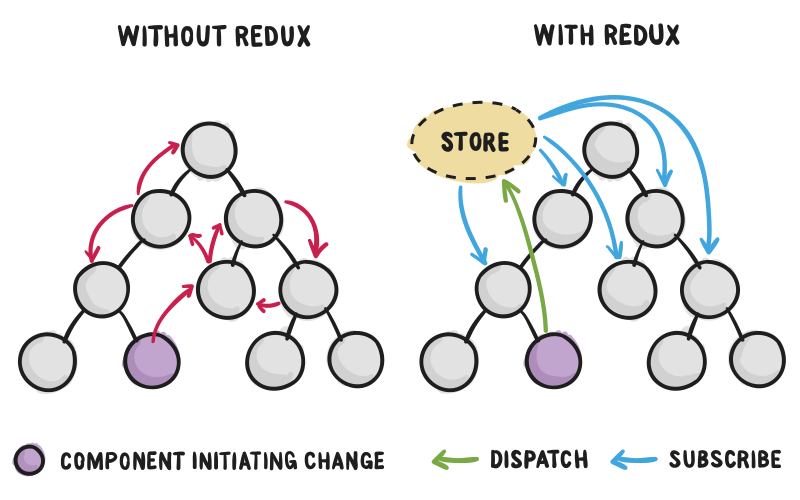

# Un confronto fra React.js e Angular

## Introduzione

Questo documento mira ad evidenziare le principali differenze fra il framework _Angular v6.1.1_ e la libreria JavaScript _React.js v16.4.2_. Questi sono fra gli strumenti oggi maggiormente utilizzati per la creazione di interfaccie per applicazioni web. 

React.js ha una storia più recente di Angular. La prima release è stata pubblicata a Marzo 2013, mentre la primissima versione di angular (Angular v1.x, anche detto Angular.js) risale ad Ottobre 2010. Nel 2015 fu rilasciato Angular 2.0.0, una nuova versione di Angular.js completamente riscritto in TypeScript e incompatibile con la precedente versione. 

Da quel momento in poi con _Angular_ si intende qualunque versione del framework dalla versione 2 in poi, mentre con _Angular.js_ si identifica la vecchia versione 1.x.

Nel presente documento le parole _Angular_ e _React.js_ si riferiscono alle versioni indicate nelle prime righe del documento. Inoltre per brevità userò la parola _React_ come sinonimo di _React.js_.

## Architettura a componenti

Angular e React si basano sul concetto di `Component`, che rappresentano i tasselli con i quali è costruita una pagina web. Si tratta di blocchi di codice HTML potenziati con funzioni JavaScript o TypeScript che implementano una certa funzionalità.

Vi sono due differenze concettuali su come React e Angular organizzano il lavoro.

_Angular_ distingue i **servizi** dai **componenti**. La documentazione ufficiale

[^1]: Disponibile sul sito https://angular.io/

dice che un servizio è un'insieme di funzionalità di cui un'applicazione necessita. Il componente dovrebbe solamente abilitare la presentazione dei contenuti e l'interazione con l'utente, ma dovrebbe delegare il 'come farlo' ad uno o più servizi.

Quindi seguendo l'approccio a servizi di Angular, rappresentato nella figura sottostante, ogni componente che necessiti di dati esterni dovrà essere dotato di un servizio che in qualche modo glieli fornisca (sia tramite richieste remote oppure attingendo da una cache locale).




La dichiarazione di un servizio è effettuata nel seguente modo, specificando nei _metadati_ di `@Injectable` il nome del componente nel quale sarà iniettato.

```typescript
@Injectable ({
	providedIn: 'app-mycomponent',
})
export class Service {
    constructor() {}
    
    fetchData() : DataType {
    	return fetch(...).then(...).catch(...);
	}
}
```

Al componente che lo utilizza basta inserire un parametro di tipo `Service` nel costruttore. Di come e quando istanziare il servizio se ne occupa il framework.

```typescript
@Component({
  selector: 'app-mycomponent',	// nome del componente
  templateUrl: './mycomponent.component.html',
  styleUrls: [ './mycomponent.component.css' ]
})
export class MyComponent implements OnInit {

  constructor(private service: Service) { }

  ngOnInit() {
    this.getData();
  }

  getData() : void {
    this.service.fetchData();
  }
}
```

In *React.js* non esiste tale distinzione: tutto è un **componente**. La creazione di classi per separare elementi presentazionali da moduli di recupero di dati è totalmente a discrezione del programmatore. Questa è una delle ragioni per le quali moltissime applicazioni in React utilizzano anche Redux o altre librerie di gestione dello stato, che tratterò in seguito.

Quindi, mentre in Angular vi è un preciso modo di separare la logica di presentazione dal reperimento dei dati da visualizzare, in React non vi è un meccanismo pronto per tale obiettivo.

Un componente in React estende la classe `Component` ed è dichiarato nel seguente modo:

```jsx
import React from 'react';

export class Component extends React.Component {
  this.state = {
    // inizializzazione dei campi dello stato del componente       
  }

  render() { // specifica l'HTML a cui corrisponde il component
    return (
      <div>
      	<OtherComponent />
      </div>
  	)
  }
}
```

Mentre in Angular ad un Component corrisponde sempre del codice HTML, in React non è così. Un component potrebbe funzionare da semplice wrapper,  per esempio effettuando dei controlli prima di mostrare altri componenti, e in generale decorandoli di funzionalità. In effetti un componente di React non è altro che una classe/funzione JavaScript, con un metodo _render()_ che definisce il codice HTML.
In Angular invece, la natura ben definita di un componente rende necessario avere un corrispettivo frammento di pagina HTML da mostrare nel browser. Per il resto esistono i servizi.

### Condivisione di dati fra componenti

In una applicazione *React* lo stato dell'applicazione è mantenuto da uno o più componenti. React implementa un one-way data binding nel quale il flusso dei dati scende seguendo la gerarchia di componenti. Nei casi in cui serva interazione dell'utente con i componenti è però spesso necessario avere un modo di far fluire i dati nella direzione opposta, quindi dalla view, verso lo stato interno dell'applicazione. Ad esempio ad un click dell'utente, si potrebbe dover modificare un certo dato contenuto nello stato. Utilizzando solamente React questo si può fare con un meccanismo di callback: ogni componente che contiene stato (detto _stateful_) può esporre dei metodi per modificare il suo stato interno. Può dunque passare questi metodi ai componenti figli. Questo avviene tramite il passaggio di _props_, ovvero di proprietà, che possono essere un qualunque tipo di oggetto JavaScript, incluse quindi funzioni. Come rappresentato nella figura sotto, un componente che voglia modificare lo stato di un componente più alto nella gerarchia deve invocare su di esso uno di questi metodi.
In questo modo è il componente che contiene lo stato a fornire ai figli i dati da visualizzare e le funzioni da invocare quando sia necessario effettuare un'operazione sui dati. I componenti figli, in questo caso, sono chiamati _componenti controllati_, in quanto non hanno uno stato e la loro apparenza nella vista è completamente definita dallo stato dei componenti sopra di loro.



**Fig. Esecuzione di *callback* verso un componente genitore in React.js**



**Fig. Passaggio di *props* in React.js**


#### Potenzialità diverse

Essendo Angular un framework e React una semplice libreria essi hanno una grado di completezza ben differente. Per la precisione Angular è un framework MVC-MVVM (Model View Controller - Model View View-Model) e offre un insieme di strumenti da utilizzare assieme per far fronte ad ogni esigenza di uno sviluppatore. React è una libreria con poche funzionalità rispetto al primo. Di conseguenza per effettuare un confronto significativo assumerò che l'utilizzo di React sia complementato da un certo numero di librerie che lo rendano paragonabile ad Angular (https://medium.com/dailyjs/react-and-angular-a-contrast-b19210c3fe89). I principali strumenti che mancano a React.js e che invece sono forniti in Angular, sono:

- Gestione dello stato;
- Routing client-side;
- Gestione di richieste Http;
- Css scoping.

##### Gestione dello stato

Una web application dovrà mostrare dei dati all'utente, che solitamente sono reperiti da un server remoto. Una volta che questi dati siano stati ottenuti l'applicazione dovrà salvarli da qualche parte per poterli visualizzare. In un'applicazione in stile _restful_ questo stato ha natura volatile, e viene continuamente sincronizzato con il server. Avere uno stato locale può essere utile ad esempio per effettuare operazioni di ricerca o di filtraggio degli elementi visualizzati senza alcun intervento del server. Per gestione dello stato intendo quindi il problema di dove e come mantenere questi dati per poterli presentare e manipolare.

Vi sono varie librerie di _state management_ che possono essere utilizzate in **Angular,** fra le quali NGRX (una specie di adattamento ad Angular di Redux) e la più recente NGXS. Queste librerie implementano un popolare paradigma nel quale l'intero stato dell'applicazione viene mantenuto all'interno di un unico oggetto definito _store_.

###### Cos'è e quando serve uno _store_?

Tutte le librerie di _state management_ definiscono Store l'oggetto o la collezione di oggetti che contengono tutti i dati dell'applicazione. Quindi lo store potrebbe contenere sia i dati reperiti da un server, che informazioni sullo stato della GUI. In genere queste librerie forniscono meccanismi di _iscrizione_ dei componenti a certe parti dello store. Qual'ora qualche dato nello store fosse modificato, ad esempio in seguito ad una sincronizzazione con il server oppure ad un evento scatenato dall'utente, tutti i componenti iscritti a quel dato saranno automaticamente notificati e aggiornati. Quindi si tratta di una implementazione del pattern _Observable_.

Non è detto che ci sia bisogno di utilizzare uno store, ovvero di uno o più oggetti dedicati al mantenimento dei dati. È anche possibile far in modo che ogni elemento che abbia necessità dei dati effettui la propria richiesta al server e una volta ottenuti li utilizzi come deve.

Il grosso vantaggio di uno store, tralasciando considerazioni progettuali sulla scelta di centralizzare il modello dei dati del client, si percepisce quando diversi componenti di una applicazione web hanno bisogno di accedere ad uno stesso dato. In questa situazione rifare la stessa richiesta da diversi componenti può diventare inutile visto che quel dato era già stato prelevato in precedenza. Un'altra situazione nel quale può tornare utile centralizzare lo stato è quando più attori, (per esempio server e utente client) possono modificare i dati, ed in tal caso avere diverse istanze di essi può diventare difficile da gestire.

(Fonte: Angular Service Layers: Redux, RxJs and Ngrx Store - When to Use a Store And Why?, giugno 2018)

------

Tuttavia, particolarmente in Angular, non vi è necessità di utilizzare una delle succitate librerie. Angular, a differenza di React, propone l'utilizzo dei _servizi_. Come già detto un servizio è un oggetto che mette a disposizione tutte le funzionalità di cui un componente necessita. Uno dei problemi che l'utilizzo di uno store risolve elegantemente è la necessità di fornire gli stessi dati a più componenti. Tuttavia Angular fornisce un avanzato meccanismo di *dependency injection* che, tramite l'utilizzo di servizi, risolve questo problema (https://blog.angular-university.io/angular-2-redux-ngrx-rxjs/). Infatti:

- è possibile creare servizi ed effettuarne l'_injection_ in specifici componenti;
- i servizi di Angular possono mantenere localmente dei dati e condividerli in più componenti nei quali sono iniettati;
- ogni servizio iniettato in una data gerarchia di componenti è un _singleton_. Ovvero tutta la gerarchia condividerà la stessa istanza del servizio (https://angular.io/guide/dependency-injection-in-action).

Quindi un servizio di Angular può all'occorrenza agire come un piccolo _store_, diventando la sola sorgente di quel dato per tutti i componenti che lo richiedono.

**React**, invece, non beneficia del meccanismo di _dependency injection_ di Angular. La condivisione di dati fra componenti avviene attraverso un passaggio di proprietà lungo la gerarchia di componenti. Diventa quindi desiderabile avere uno stato esterno ad  ogni componente che sia l'unica sorgente di dati dell'intera applicazione. L'implementazione del pattern observable fra i componenti e lo store, offerta nativamente in queste librerie, fa in modo che i componenti rispecchino in ogni momento i dati contenuti nello store.

Come si vede nella figura sotto, l'utilizzo di una libreria come Redux, delega il Redux store a contenere l'intero stato dell'applicazione. Tramite il pattern Observable i componenti connessi (o iscritti) allo store sono automaticamente notificati di ogni cambiamento ad esso. L'utilizzo di questa libreria è molto popolare visto che elimina la necessità di distribuire callback ai componenti figli ai fini di far fluire informazioni nel senso opposto alla gerarchia. Più informazioni sull'interazione fra React e Redux sono fornite nella prossima sezione.



Fig. Flusso dei dati in React con e senza Redux.

Redux (https://redux.js.org/)

##### Routing

Il routing su una web application permette il caricamento di componenti diversi a seconda dell'URL della pagina. Permette l'emulazione del cambio pagina al click su un link, pur senza effettuare un ricaricamento della pagina, e abilita l'utente a salvare l'indirizzo delle pagine nei preferiti ed a utilizzare i pulsanti di navigazione del browser. React non fornisce alcuna soluzione di questo genere. Angular invece fornisce il pacchetto `@angular-router` all'interno del framework. Per l'utilizzo in React sono disponibili diverse soluzioni, fra le quali `React-mini-router`, `React-router` e `Universal-router`.

React-router (https://reacttraining.com/react-router/)

##### Gestione di richieste Http

Nel caso l'applicazione web richieda di reperire dati remoti è necessario effettuare chiamate Http. Angular suggerisce l'utilizzo della _reactive programming_ e del tipo _Observable_, disponibile nella libreria `Rxjs`, già inclusa nel framework. Per React invece è necessario installare una qualunque libreria. Se si vuole utilizzare l'approccio simile ad Angular con React e Redux esiste `redux-observable`

[^3]: https://redux-observable.js.org/

. Oppure è possibile utilizzare Redux con librerie come `axios`

[^4]: https://github.com/axios/axios

 o `fetch`, che fa da poco parte dello standard JavaScript.

##### Scoping del foglio di stile

Angular permette di definire fra i _metadata_ di un componente anche il foglio di stile da utiliizare per esso. Questo può essere fatto come si vede alla linea 4 del blocco di codice sottostante. Il _css_ associato ad un componente è specifico per esso e quindi non influisce sui template di tutti gli altri componenti. Questa soluzione ha il vantaggio di evitare effetti indesiderati dovuti alla ripetizione di nomi di classi o ad interferenze fra di esse.

```typescript
@Component({
  selector: 'my-component',
  templateUrl: './mycomponent.component.html',
  styleUrls: [ './mycomponent.component.css' ]
})
export class MyComponent implements OnInit {
  ...
}
```

In React, per far uso di una soluzione simile, è necessario installare il pacchetto _react css modules_ (https://github.com/gajus/react-css-modules), tramite il quale è possibile assegnare ad ogni componente uno specifico foglio di stile, sfruttando il pattern decorator. Al caricamento del componente ad ogni tag HTML saranno associati nomi di classi univoci che garantiscono la non interferenza con gli altri fogli di stile.

React-css-modules (https://github.com/gajus/react-css-modules)

Link: 

- https://kuanhsuh.github.io/2017/09/28/What-s-Redux-and-how-to-use-it/
- https://medium.com/@ttemplier/angular2-decorators-and-class-inheritance-905921dbd1b7

## React, Redux e la gestione dello stato

### Cos'è Redux?

React e Redux sono due librerie separate e mantenute da team differenti che non devono necessariamente essere utilizzate assieme. 

Redux è una libreria che offre un container per lo stato di applicazioni JavaScript. Si è ispirato a Flux, un pattern architetturale sviluppato da Facebook specificatamente per l'utilizzo con React. Redux si basa su tre principi

[^6]: https://redux.js.org/introduction/threeprinciples

:

- Singola sorgente di dati: tutto lo stato dell'applicazione è contenuto all'interno di un oggetto in un unico store (Flux invece prevedeva Store multipli);
- Lo store è in sola lettura: non è possibile modificare direttamente lo stato in esso contenuto. L'unico modo di farlo è emettere un'azione e farla processare ad un _reducer_;
- I cambiamenti allo store sono effettuati con funzioni pure: un reducer non effettua side effect, ma restituisce il nuovo stato in un nuovo oggetto.

L'utilizzo di React con Redux si basa sulla possibilità di *iscrivere* i componenti React ai pezzetti di Redux store di cui hanno bisogno. è anche possibile utilizzare Redux con un approccio simile a quello di Angular utilizzando RxJs per gestire le chiamate Http facendo uso del middleware `redux-observable`.

### React e Redux

Con React-Redux tutto lo stato dell'applicazione, i dati da visualizzare e lo stato della UI, può essere salvato all'interno del Redux store. L'unico modo di apportare modifiche a questo oggetto è effettuare il _dispatch_ di _actions_ che contengono le 'istruzioni' di cosa cambiare e come farlo. Un'azione non è altro che un oggetto che normalmente ha la seguente struttura:

```javascript
const typicalAction = {
	type: 'REMOVE_OBJECT' // dichiara cosa vuole fare l'azione
    payload: id 		  // eventuali parametri necessari per completare l'azione
}
```

Quando un'azione viene 'mandata' verso lo store questa viene processata da un _reducer_. Il reducer è una funzione _pura_ che dato lo stato precedente e l'azione da compiere ritorna lo stato successivo (non modifica lo stato precedente, ma fa una _deep copy_ dell'oggetto, lo altera e lo restituisce).

Il meccanismo ad azioni può essere sfruttato anche per popolare lo store con i dati, che spesso sono inviati da un server, e quindi devono essere ottenuti tramite chiamate REST, che sono asincrone. Quindi in questo caso le azioni dovrebbero attendere che i dati arrivino. Il reducer non può sapere di questa attesa e si aspetta un risultato immediato. È possibile gestire tale asinconia utilizzando un _middleware_, che è semplicemente una funzione che attende il completamento di un'azione asincrona prima di effettuare il dispatch dell'azione appropriata verso il reducer. Questo permette di attendere risposta dal server e poi effettuare il dispatch corretto in caso di successo, oppure di errore. Per React esistono vari middleware che svolgono questo compito. Uno molto utilzzato e molto semplice è `redux-thunk`. ve ne sono altri più complessi come `redux-saga` e `redux-promise-middleware` che seguono un approccio più personalizzato.
La figura sottostante riporta lo schema di azione generale in React-redux, a partire dal emissione di un evento dalla view, fino all'aggiornamento del componente con i dati dello store.


**Fig. 3 Interazione fra Componenti (view), azioni e stato in React-redux **


Una volta definite delle azioni asincrone che utilizzano un middleware esse vanno rese disponibili al componente perchè le possa chiamare (ad esempio al caricamento del componente nella pagina). Per fare questo la libreria `react-redux`

[^5]: è il collegamento ufficiale fra React.js e Redux, disponibile al seguente link: https://github.com/reduxjs/react-redux

 mette a disposizione la funzione `connect()`.

Tale funzione decora (utilizzando il pattern _decorator_) un component iniettando in esso delle proprietà. Serve però indicare a Redux come trasporre il suo *store* in proprietà, fornendo solo quello che serve ad un componente. Per questa ragione si definiscono i seguenti due metodi (i nomi sono arbitrari, ma convenzionalmente sono sempre questi):

- `mapStateToProps`: definisce come lo stato di Redux deve essere trasformato nelle proprietà che sono passate al component. In questo metodo è possibile accedere a tutto lo stato, ma difficilemente ogni sua parte sarà utile ad un componente, che avrà bisogno solo di un preciso sottoinsieme.
- `mapDispatchToProps`: nella sua implementazione base rende disponibile la funzione `dispatch` al component, permettendogli di operare azioni sullo stato, che altrimenti non sarebbe accessibile. È però usanza comune definire anche in questo caso proprietà che corrispondono ad azioni (quindi a funzioni), in modo da dichiarare chiaramente di quali azioni è possibile fare il dispatch in ogni componente.

In genere questi componenti 'connessi' allo store di Redux sono chiamati _container_ perchè potendovi accedere acquisiscono la capacità di ottenere dati e modificarli.

Un esempio di _container_ è il seguente.

```javascript
import { connect } from 'react-redux'
import { someAction } from './actions'
import MyComponent from './MyComponent'

const mapStateToProps = state => ({
    prop1: state.prop1,
    prop2: state.prop2,
});

const mapDispatchToProps = dispatch => ({
    fun: () => dispatch(someAction())
});

export default connect(mapStateToProps, mapDispatchToProps)(MyComponent);
```

Nell'esempio la `connect` rende disponibile al component `MyComponent` le proprietà `prop1`, `prop2` e `fun` che è una funzione, per esempio da invocare all'avvenire di qualche evento. Si noti che `MyComponent`, nell'esempio riportato, non è consapevole della fonte di nessuna delle tre proprietà che il container recupera dallo store.
Questa è la maniera con cui in React-redux è possibile separare componenti puramente presentazionali (*component*) dal meccanismo di ottenimento dei dati da visualizzare (del quale si occupa il _container_).

## Routing: React router e Angular router

In una *single page application* non ci sono veri e propri cambi di pagina così come non si effettuano refresh.  Inoltre sarebbe impossibile utilizzare un link tradizionale perchè non si potrebbe specificare una pagina di destinazione in `<a href="">` in quanto una web app in Angular o React è una composizione di Component, e non esiste il concetto di 'pagina'. Il _routing client-side_ serve quindi a simulare la navigazione in pagine diverse permettendo di sostituire un component con un'altro component, senza effettivamente cambiare pagina o effettuare redirezioni. Il routing abilita inoltre l'utente a salvare tra i preferiti una specifica pagina dell'applicazione e ad utilizzare i pulsanti back/forward del browser nell'applicazione.

React.js non possiede mecanismi di routing intergrati, in quanto è solo una libreria. Al contrario Angular integra il suo router tramite il pacchetto `@angular/router`. Come già accennato, vi sono varie soluzioni che assolvono allo stesso compito per React, ma la più utilizzata e una delle meglio documentate è `React-router.`

L'unica significativa differenza riguarda il funzionamento "sotto il cofano" dei due pacchetti, non tanto l'agio di utilizzo. _Angular router_ usa **routing statico**. Ovvero le route sono dichiarate in un file che viene caricato durante l'inizializzazione dell'app, prima che qualunque componente sia caricato e mostrato.

Invece in _React-router_ (dalla versione 4 in poi) il routing avviene direttamente quando viene mostrata l'applicazione, non all'avvio dell'app. Questo perchè ogni pezzo di react-router è un component, che 'decide' cosa mostrare quando esso viene caricato nell'app. In questo caso si parla di **routing dinamico**.

Per fare un esempio pratico, in React-router ogni _route_ viene definita da un componente `Route`. Per una route definita come `<Route path="/path" component={Component}>`, essa mostra il componente 'Component' solo se l'indirizzo del browser è '/path'. Altrimenti non mostra nulla.

React-router quindi segue l'approccio dichiarativo di React.js, nel quale ogni cosa è un componente. Angular router invece usa un approccio più tradizionale. Ad ogni modo sono diponibili pacchetti per effettuare il routing statico anche con React.

## Ciclo di sviluppo e mantenimento

Per gli sviluppatori è importante conoscere la stabilità del framework a versione di riferimento e sapere che il loro lavoro non sarà buttato dopo qualche mese per un aggiornamento del framework che rende inutile tutto quello che avevano fatto.

**Angular** è mantenuto dal team di sviluppo di Google. Una versione di angular è identificata dal formato `x.y.z`.

- x: _major release_ che continene nuove funzionalità e può rimuoverne di esistenti. È previsto possa dover essere fatta della manutenzione al codice dopo l'aggiornamento.
- y: _minor release_ che può introdurre nuove funzionalità, e mantiene campleta compatibilità con quelle esistenti. Non è previsto nessun 'adattamento' alle nuove aggiunte, ma potrebbe essere necessario imparare nuove API.
- z: _patch_: aggiornamento di sicurezza senza rischi associati. Corregge bug e non è necessario alcuno sforzo.

### Frequenza

- 1 major release ogni 6 mesi
- 1-3 minor release ogni major release (quindi in circa 6 mesi)
- una patch release circa ogni settimana

### Support & Deprecation policy

All'uscita di una nuova major release, la versione precedente entra nelle fase LTS, nella quale saranno fornite solo patch di aggiornamento per fix e per la sicurezza. Il supporto LTS ha la durata di 12 mesi. Quindi ogni versione resta supportata e aggiornata per circa 18 mesi (6 attiva + 12 LTS).

Ogni fuzionalità deprecata è listata nei changelog di ogni versione. Viene sempre fornito supporto proponendo soluzioni consigliate per aggiornare il codice rimuovendo le funzionalità deprecate. Ogni funzionalità deprecata viene supportata almeno nelle due major release successive.

Info: https://angular.io/guide/releases


**React** segue lo stesso schema di nomenclatura per la versione, ma non ha una frequenza di aggiornamento definita come Angular. Gli aggiornamenti hanno in media una cadenza mensile, ma vengono rilasciati anche più in fretta se necessario per correggere bug.

Anche in questo caso solo le major release possono introdurre cambiamenti radicali rimuovendo o deprecando funzionalità, che restano comunque supportate fino almeno alla versione successiva. La documentazione non aggiunge dettagli più precisi su questo aspetto.

Info: https://github.com/facebook/react/releases

## Data binding

Una delle differenze più evidenti è il modo di collegare il modello dei dati alle view. React è spiccatamente `one way data binding`, ovvero dal modello verso le view.

Angular, anche se può essere utilizzato allo stesso modo, rende molto conveniente collegare anche fa rispecchiare i cambiamenti sulla view (es un `<input>` modificato) direttamente al modello

`ngModel` è la direttiva che permette di collegare un certo elemento direttamente con la sorgente del dato che esso visualizza. Qui sotto uno snippet di codice **Angular** per collegare un input testuale al modello. Vi sarebbe un file contenente il seguente pezzo di HTML.

```html
<input type="text" [(ngModel)]="data.property">
```

E il corrispondente codice TypeScript in `Component.ts` sarebbe:

```typescript
@Component({
  selector: 'app-heroes',
  templateUrl: './heroes.component.html',
  styleUrls: ['./heroes.component.css']
})
class HeroesComponent implements OnInit {
  data: Type = {
    id: 1,
    property: 'some value'
  };
 
  constructor() { }
 
  ngOnInit() { }
 
}
```

Ogni modifica apportata grazie al campo input si rifletterebbe sul campo dati `data.property` grazie al two way data binding.

In **React.js** invece questo va implementato 'a mano', ad esempio nel seguente modo.

```jsx
class Component extends React.Component {
    this.state = {
			value: ''        
    }

    handleChange(e) {								// callback
      const { value } = e.target		// recupera il valore digitato dall'utente
      this.setState({								// aggiorna lo stato locale
        value,
      })
    }

    render() {
      return (
          <input type="text" onChange={e => this.handleChange(e)} />
        )
    }
}
```

In entrambi i casi modificando il testo nella casella di input cambierebbe il valore anche nel component.

Come si nota dai due esempi precedenti, mentre in Angular il template HTML corripondente ad un componente si trova in un file separato, specificato nei metadati del componente (*templateUrl*), in React esso viene accorpato alla calsse del componente. Precisamente viene definito all'interno del metodo `render()`. Il grado di spearazione fra HTML e JavaScript è un'altra differenza fra il framework e la libreria.

## DOM e Virtual DOM

React e Angular si differenziano anche nel modo con cui effettuano gli aggiornamenti della pagina web, al cambiamento dello stato. React utilizza il Virtual DOM. Quindi crea una copia del DOM della pagina e la mantiene in memoria. Quando avviene un cambiamento genererà una nuova rappresentazione del DOM e la compara con quella precedente per individuare i componenti da aggiornare. A questo punto aggiorna la pagina agendo sul DOM e aggiornando solo gli elementi che sono cambiati. 

La naturale conseguenza di questi due approcci è che il primo utilizza maggiormente la memoria.


## TODO:

- virtual DOM vs real DOM
- @Input vs props


### Bibliografia

- https://medium.com/dailyjs/react-and-angular-a-contrast-b19210c3fe89


